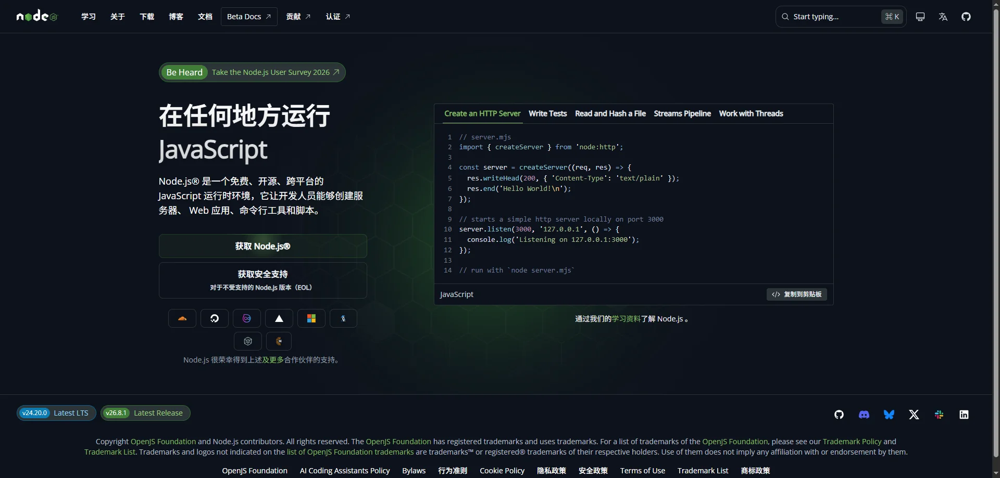
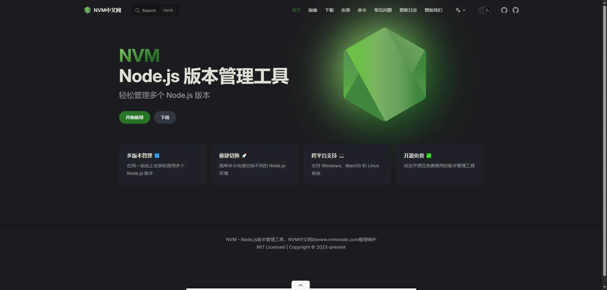
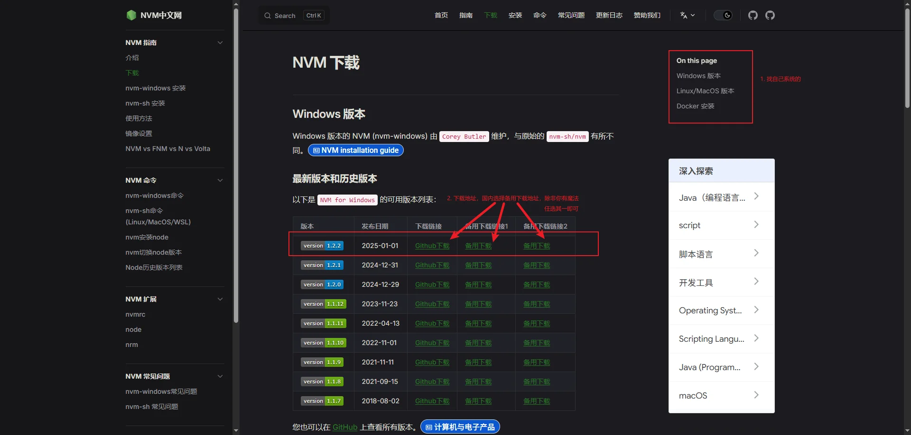
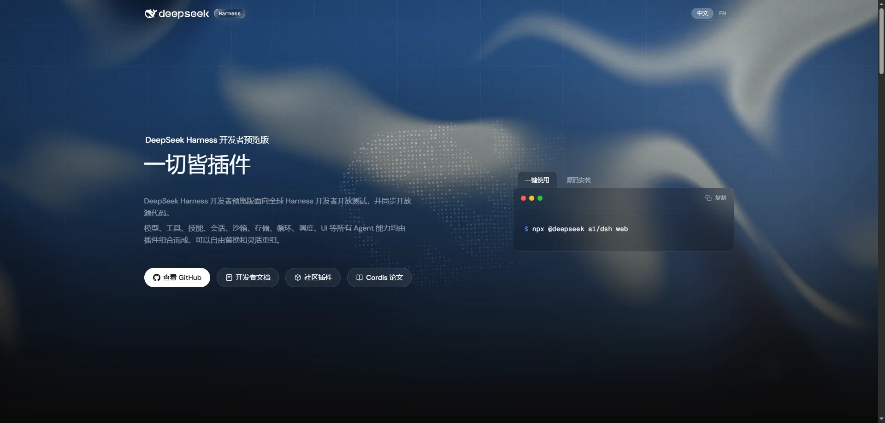

::: tip 介绍
最近 DeepSeek Harness 还挺火的，接下来就让我带着大家手把手教你部署在你电脑上 DeepSeek Harness 吧！
:::

## 一. 准备工作

不同操作系统安装方式稍有区别，这里博主用的是 windows 操作系统，假设你已经会用该系统。

```shell
操作系统：Windows 11 / Windows 10
浏览器：Google Chrome 151.0.7922.170 (64)
```

## 二. 安装 Node 环境

> 安装 Node 环境以下两个小节二选一即可 [安装 NodeJS](#_2-1-安装-node) / [安装 NVM](#_2-2-安装-nvm-推荐)

### 2.1 安装 Node

官方网站地址为 [node.js](https://nodejs.org/zh-cn)


### 2.2 安装 NVM（推荐）

中文网站地址为
[nvm](https://nodejs.org/zh-cn)
(ps: 中文网有广告)
[下载地址](https://www.nvmnode.com/zh/guide/download.html)
<br></br>
- 官方 Github 地址为 [nvm](https://github.com/nvm-sh/nvm)
<br></br>


<br></br>
- 按照文档下载步骤下载即可（如下图）



- 安装 nvm

## 三. 安装 DeepSeek Harness

官方网站地址为 [DeepSeek Harness](https://www.deepseek.com/harness/)


## 四. 注册 DeepSeek 开放平台账号

## 五. 创建 API KEY

## 六. 启动 DeepSeek Harness

## 七. 配置 API KEY

## 八. 创建工作区

## 在线体验

部署完成后，可以在这个交互终端里敲 `help` / `dsh status` / `echo` 试试（页面演示，不会真正执行部署）：

<ClientOnly>
  <r-terminal
    title="dsh@harness — 部署演示"
    prompt="dsh@harness:~$"
    :script="[
      { cmd: 'dsh install', pause: 400,
        out: [['检测 Node 环境…', 'out'], ['✔ node v22.12.0', 'ok'], ['✔ npm 10.9.0', 'ok'], ['✔ 拉取 DeepSeek Harness 完成', 'ok'], ['✔ 依赖安装完成', 'ok']] },
      { cmd: 'dsh start', pause: 500,
        out: [['启动服务…', 'out'], ['✔ harness 已启动：http://localhost:3000', 'ok']] },
      { cmd: 'dsh status', pause: 400,
        out: [['● DeepSeek Harness 运行中', 'ok'], ['  version : 3.4.2 · agent plugins: 12 · uptime: 0h 0m', 'out']] },
    ]"
  />
</ClientOnly>

## 总结

总的来说本地部署一个 DeepSeek Harness 还是需要一些步骤的，AI 虽好，但是一定要注意权限问题，不能放心胆大将系统全部权限交给 AI，毕竟确实一旦遇到问题损失不可估量。
<br></br>
虽然 AI 很好用，但固然我们要知道他背后如何实现的，不能过渡依赖于 AI，否则你的技术肯定是要退化的。
<br></br>
AI 时代对于一个合格的码农来说不仅仅要会用，还要会利用 AI 进行接入现有的业务逻辑，一步步慢慢的成长，这样你才不会被优化，哈哈哈！

这让我想到一句广告词：**`劲酒虽好，可不要贪杯哦！`**
