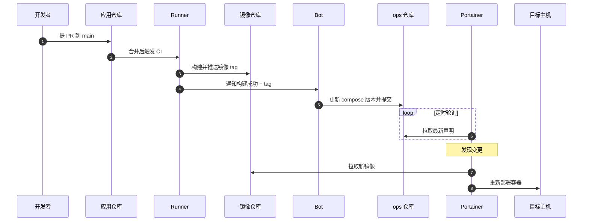

::: tip 介绍
本文带你从零搭一套**完全自托管**的 GitOps 交付链路：用 **Gitea** 托管代码与镜像、用 **Gitea Runner（act_runner）** 跑 CI 构建、用 **Portainer** 做 CD 部署。整条链路不依赖 GitHub / GitLab，一次 push 就能自动构建镜像并更新线上容器。
:::

::: info 阅读之前先了解一下什么是 GitOps
GitOps 的核心就一句话：**把 Git 仓库当作系统的唯一事实来源（Single Source of Truth）**。

- 所有「期望状态」——镜像版本、端口、环境变量——都写成仓库里的声明式文件；
- 有一个自动化 Agent 持续把线上实际状态「对齐」到这个期望状态；
- 想改线上？改仓库、提交、合并，而不是登录服务器手敲命令。

带来的好处：**可审计**（每次变更都有 commit）、**可回滚**（revert 一个 commit）、**环境一致**（同一份声明在测试 / 生产复用）。

本文各角色与 GitOps 概念的对应关系：

| GitOps 概念 | 本文实现 |
| --- | --- |
| 唯一事实来源（代码 + 部署声明） | Gitea 仓库 |
| CI（构建期望产物） | Gitea Actions + Gitea Runner |
| 制品仓库（镜像） | Gitea 内置 Container Registry |
| CD Agent（对齐实际状态） | Portainer Stack（GitOps 模式） |
:::

## 一. 方案总览

### 1.1 整体架构



一次完整的交付链路：

1. 你 push 到 Gitea；
2. Gitea 触发 Actions，Runner 开始执行流水线；
3. Runner 构建镜像并推送到 Gitea 内置 Registry；
4. Portainer 通过 Webhook（或轮询）感知到仓库变化；
5. Portainer 按仓库里的 compose 文件重新部署容器。

### 1.2 端口与目录规划

| 服务 | 镜像 | 宿主机端口 | 数据目录 | 说明 |
| --- | --- | --- | --- | --- |
| Gitea | gitea/gitea | 3000 / 222 | /opt/gitea/data | Web + SSH |
| PostgreSQL | postgres:16-alpine | 不暴露 | /opt/gitea/postgres | Gitea 数据库 |
| Gitea Runner | gitea/act_runner | 不暴露 | /opt/gitea-runner | 执行 CI |
| Portainer | portainer/portainer-ce | 9443 | /opt/portainer/data | 可视化管理 + CD |

> 下文统一用 git.example.com 代表你的域名、admin 代表 Gitea 用户名，实际替换成自己的即可。

### 1.3 前置准备

一台 Linux 服务器（本文以 Ubuntu 22.04 为例），建议 2 核 4G 起步；一个解析到该服务器的域名（用 Registry 强烈建议配 HTTPS）。

先装 Docker 与 Compose：

```shell
curl -fsSL https://get.docker.com | sh
docker version
docker compose version
```

## 二. 部署 Gitea

### 2.1 创建工作目录

```shell
mkdir -p /opt/gitea && cd /opt/gitea
```

### 2.2 编写 docker-compose.yml

```yaml
services:
  gitea:
    image: gitea/gitea:latest
    container_name: gitea
    restart: always
    environment:
      - USER_UID=1000
      - USER_GID=1000
      - GITEA__database__DB_TYPE=postgres
      - GITEA__database__HOST=db:5432
      - GITEA__database__NAME=gitea
      - GITEA__database__USER=gitea
      - GITEA__database__PASSWD=change_me
      - GITEA__server__DOMAIN=git.example.com
      - GITEA__server__ROOT_URL=https://git.example.com/
      - GITEA__server__SSH_DOMAIN=git.example.com
      - GITEA__server__SSH_PORT=222
      - GITEA__security__INSTALL_LOCK=true
      - GITEA__service__DISABLE_REGISTRATION=true
      - GITEA__actions__ENABLED=true
    volumes:
      - ./data:/data
      - /etc/timezone:/etc/timezone:ro
      - /etc/localtime:/etc/localtime:ro
    ports:
      - '3000:3000'
      - '222:22'
    depends_on:
      - db

  db:
    image: postgres:16-alpine
    container_name: gitea-db
    restart: always
    environment:
      - POSTGRES_USER=gitea
      - POSTGRES_PASSWORD=change_me
      - POSTGRES_DB=gitea
    volumes:
      - ./postgres:/var/lib/postgresql/data
```

几个关键环境变量：

- GITEA__security__INSTALL_LOCK=true：跳过 Web 安装向导，直接按环境变量初始化；
- GITEA__service__DISABLE_REGISTRATION=true：关闭注册，避免陌生人建号；
- GITEA__actions__ENABLED=true：打开 Actions（后面 Runner 要用）。

启动：

```shell
docker compose up -d
docker compose logs -f gitea
```

### 2.3 创建管理员账号

因为关闭了注册，需要手动建第一个管理员：

```shell
docker exec -u git gitea gitea admin user create \
  --username admin \
  --password 'ChangeMe_123456' \
  --email admin@example.com \
  --admin
```

然后浏览器打开 http://服务器IP:3000 登录。

### 2.4 Nginx 反向代理 + HTTPS

```nginx
server {
    listen 80;
    server_name git.example.com;
    return 301 https://$host$request_uri;
}

server {
    listen 443 ssl;
    server_name git.example.com;

    ssl_certificate     /etc/nginx/ssl/git.example.com.crt;
    ssl_certificate_key /etc/nginx/ssl/git.example.com.key;

    client_max_body_size 512m;

    location / {
        proxy_pass http://127.0.0.1:3000;
        proxy_set_header Host              $host;
        proxy_set_header X-Real-IP         $remote_addr;
        proxy_set_header X-Forwarded-For   $proxy_add_x_forwarded_for;
        proxy_set_header X-Forwarded-Proto $scheme;
    }
}
```

### 2.5 创建仓库与访问令牌

1. 右上角 + → 新建仓库，命名为 demo-app；
2. 右上角头像 → 设置 → 应用 → **生成新令牌**，权限至少勾选 write:package（推送镜像）与 write:repository（后续 CI 提交声明文件）。

把令牌复制保存好，后面 CI 的 Secret 和 Portainer 的仓库认证都要用它。

## 三. 部署 Gitea Runner

### 3.1 获取注册 Token

Gitea → 管理后台（或直接访问 /-/admin）→ **Actions** → **Runners** → **创建 Runner**，复制弹出的 token（只显示一次）。

### 3.2 注册 Runner

```shell
mkdir -p /opt/gitea-runner && cd /opt/gitea-runner

docker run --rm -it \
  -v /var/run/docker.sock:/var/run/docker.sock \
  -v /opt/gitea-runner:/data \
  gitea/act_runner:latest \
  act_runner register \
    --no-interactive \
    --instance https://git.example.com \
    --token 你的注册Token \
    --name runner-01 \
    --labels ubuntu-latest:docker://catthehacker/ubuntu:act-latest
```

--labels 是「任务标签:执行镜像」的映射：工作流里写 runs-on: ubuntu-latest，任务就会跑在 catthehacker/ubuntu:act-latest 容器里（这个镜像自带 git / node / docker CLI，适合跑构建）。

### 3.3 常驻运行

注册成功后 /opt/gitea-runner 下会生成 .runner 文件，之后启动不再需要 token：

```yaml
services:
  runner:
    image: gitea/act_runner:latest
    container_name: gitea-runner
    restart: always
    environment:
      - CONFIG_FILE=/data/config.yaml
      - GITEA_INSTANCE_URL=https://git.example.com
      - GITEA_RUNNER_NAME=runner-01
    volumes:
      - /var/run/docker.sock:/var/run/docker.sock
      - ./data:/data
```

```shell
docker compose up -d
docker compose logs -f
```

回到管理后台的 Runners 页面，应能看到 runner-01 处于 **Idle** 状态。

::: warning 关于 docker.sock 的安全
把 /var/run/docker.sock 挂给 Runner，等价于把宿主机 root 权限交给它——流水线里能起特权容器、能挂宿主机任意目录。生产环境建议把 Runner 放在独立构建机上，或用 rootless / DinD 方案隔离。
:::

### 3.4 config.yaml 关键项

act_runner 的配置默认在 /data/config.yaml，常改的是这几项：

```yaml
runner:
  file: /data/.runner
  labels:
    - "ubuntu-latest:docker://catthehacker/ubuntu:act-latest"

cache:
  enabled: true
  dir: /data/cache
```

改完 docker compose restart 生效。

## 四. 编写 CI 流水线

### 4.1 项目结构

```markmap
# demo-app/
- Dockerfile
- src/
  - server.js
- .gitea/
  - workflows/
    - build.yml
```

### 4.2 Dockerfile

```dockerfile
FROM node:20-alpine
WORKDIR /app
COPY package*.json ./
RUN npm ci --omit=dev
COPY src ./src
EXPOSE 3000
CMD ["node", "src/server.js"]
```

### 4.3 工作流 .gitea/workflows/build.yml

```yaml
name: build-and-push

on:
  push:
    branches: [main]
    tags: ["v*"]

env:
  REGISTRY: git.example.com
  IMAGE: git.example.com/admin/demo-app

jobs:
  build:
    runs-on: ubuntu-latest
    steps:
      - name: Checkout
        uses: actions/checkout@v4

      - name: Login to Gitea Registry
        run: echo "${{ secrets.REGISTRY_TOKEN }}" | docker login "$REGISTRY" -u "${{ secrets.REGISTRY_USERNAME }}" --password-stdin

      - name: Build and push
        run: |
          docker build -t "$IMAGE:latest" -t "$IMAGE:${{ gitea.sha }}" .
          docker push "$IMAGE:latest"
          docker push "$IMAGE:${{ gitea.sha }}"
```

要点：

- Gitea Actions 兼容 GitHub Actions 语法，actions/checkout@v4 这类官方 Action 默认从 GitHub 拉取；纯内网环境可在 app.ini 里把 [actions] DEFAULT_ACTIONS_URL 指向自建镜像站。
- gitea.sha 是 Gitea 注入的上下文变量，等价于 GitHub 的 github.sha；同理还有 gitea.repository、gitea.ref_name 等。
- 同时打 latest 和 commit sha 两个 tag：前者部署方便，后者方便回滚与追溯。
- 需要更快的构建，可以换成 docker/setup-buildx-action + docker/build-push-action，配合 Registry 做 layer 缓存。

### 4.4 配置 Secrets

仓库 → 设置 → **Actions** → **Secrets** → 新增：

| 名称 | 值 |
| --- | --- |
| REGISTRY_USERNAME | admin |
| REGISTRY_TOKEN | 2.5 生成的访问令牌 |

### 4.5 触发验证

```shell
git add .
git commit -m "chore: add ci"
git push origin main
```

在仓库的 **Actions** 页签能看到流水线执行；跑完后到「头像 → 软件包」里能看到 demo-app 镜像。

## 五. 部署 Portainer

```yaml
services:
  portainer:
    image: portainer/portainer-ce:latest
    container_name: portainer
    restart: always
    command: -H unix:///var/run/docker.sock
    ports:
      - '9443:9443'
      - '8000:8000'
    volumes:
      - /var/run/docker.sock:/var/run/docker.sock
      - ./data:/data
```

```shell
docker compose up -d
```

浏览器打开 https://服务器IP:9443，首次访问设置管理员密码。

### 5.1 添加 Gitea Registry 凭据

Portainer → **Registries** → **Add registry** → **Custom registry**：

| 字段 | 值 |
| --- | --- |
| Registry URL | git.example.com |
| Username | admin |
| Password | Gitea 访问令牌 |

少了这一步，Portainer 拉私有镜像会报 401 Unauthorized。

## 六. 用 Portainer 的 GitOps 模式部署

### 6.1 准备部署声明

在仓库里放一份部署用的 compose（和业务代码分开，放在 deploy/ 下）：

```yaml
services:
  demo-app:
    image: git.example.com/admin/demo-app:latest
    container_name: demo-app
    restart: always
    ports:
      - '8080:3000'
    environment:
      - NODE_ENV=production
```

### 6.2 从 Git 仓库创建 Stack

Portainer → **Stacks** → **Add stack** → 选 **Repository**：

| 字段 | 值 |
| --- | --- |
| Repository URL | https://git.example.com/admin/demo-app.git |
| Authentication | 用户名 admin + 访问令牌 |
| Repository reference | refs/heads/main |
| Compose path | deploy/docker-compose.yml |

关键是打开 **GitOps updates**，模式选 **Webhook**（不想配 webhook 也可以选 Polling 轮询）。创建后 Portainer 会立刻按仓库里的声明把容器拉起来。

### 6.3 配 Webhook 实现「push 即部署」

1. 在 Stack 详情页复制 **Webhook URL**，形如 https://portainer.example.com/api/stacks/webhooks/xxxxxxxx；
2. 回到 Gitea 仓库 → 设置 → **Webhook** → 添加 Webhook → **Gitea**；
3. 目标 URL 填上面的地址，触发事件勾选 **推送**，保存。

之后每次 push，Gitea 通知 Portainer，Portainer 拉取最新仓库并重新部署——这就是「声明即部署」。

### 6.4 进阶：把镜像版本写进声明

前面用的是 latest，简单但不可追溯。真正 GitOps 的做法是让 CI 把新版本号提交回仓库：

```shell
sed -i "s#demo-app:.*#demo-app:${GITEA_SHA}#" deploy/docker-compose.yml
git commit -am "chore: bump demo-app to ${GITEA_SHA}"
git push
```

这样每次上线的版本都对应一个 commit，出问题 git revert 再 push 就能回滚。

## 七. 一次完整的 GitOps 交付

<ClientOnly>
  <r-terminal
    title="GitOps 交付演示"
    prompt="~/demo-app$"
    :script="[
      { cmd: 'git push origin main', pause: 600,
        out: [['枚举对象中: 12，完成.', 'out'], ['   a1b2c3d..e4f5a6b  main -> main', 'ok'], ['✔ 已触发 Gitea Actions (build-and-push)', 'ok']] },
      { cmd: 'docker images | grep demo-app', pause: 700,
        out: [['git.example.com/admin/demo-app   latest    e4f5a6b   5 seconds ago', 'out'], ['git.example.com/admin/demo-app   e4f5a6b   e4f5a6b   5 seconds ago', 'out'], ['✔ 镜像已推送至 Gitea Registry', 'ok']] },
      { cmd: 'curl -I http://localhost:8080', pause: 600,
        out: [['HTTP/1.1 200 OK', 'ok'], ['✔ 新版本容器已上线', 'ok']] },
    ]"
  />
</ClientOnly>

## 八. 常见问题

::: warning Runner 一直显示 Offline
依次检查：GITEA_INSTANCE_URL 是否能通、注册 token 是否过期、config.yaml 里的 labels 与工作流 runs-on 是否对得上。改完配置记得 docker compose restart。
:::

::: warning 推送镜像报 x509 / HTTPS 错误
Gitea Registry 默认走 HTTPS。没配证书时，要么给域名配好证书，要么在 /etc/docker/daemon.json 里加 insecure-registries 并重启 Docker（仅测试环境）。
:::

::: warning Portainer 拉镜像 401 Unauthorized
没有在 Portainer 的 **Registries** 里添加 Gitea 凭据，或令牌权限不足、已过期。
:::

::: warning Portainer Webhook 没反应
先确认 Portainer 的 Webhook URL 能从 Gitea 服务器访问（内网地址往往不通）；实在不行把 GitOps 更新模式换成 Polling。
:::

::: warning CI 拉不到 actions/checkout
Runner 需要能访问 DEFAULT_ACTIONS_URL（默认 GitHub）。内网环境请自建 Actions 镜像源并修改 app.ini。
:::

## 总结

整套链路拆开看其实只有三件事：**Gitea 存代码和镜像**、**Runner 负责构建产物**、**Portainer 按声明对齐线上**。真正让它们变成 GitOps 的，是最后那一步——线上长什么样，由仓库里的文件说了算。

自托管的代价是前期要多折腾一点部署和证书，但换来的是完全可控的交付链路：没有平台费用、没有外网依赖，所有记录都在自己的仓库里。

最后还是要啰嗦一句：**Runner 的 docker.sock 权限、Portainer 的管理端口、Registry 的证书**，这三处是这套方案里最容易被忽略、也最危险的地方，上线前记得收口。
