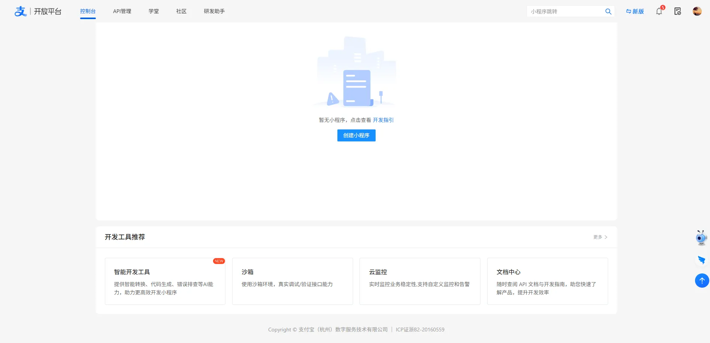
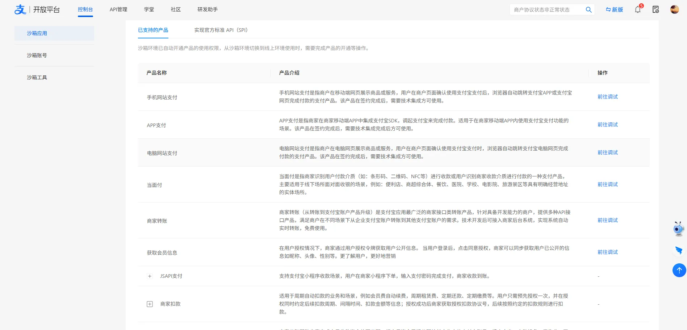
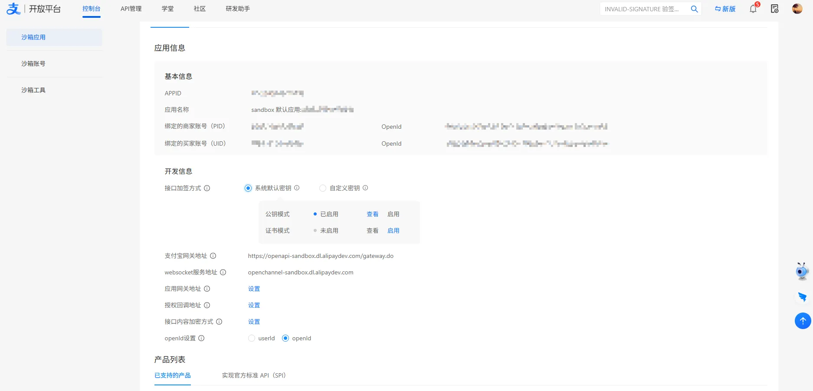

:::info 前提条件
已经入驻支付宝开放平台，详情请参见 [开发者账号注册](https://opendocs.alipay.com/common/08yegz)。
:::

## 一、什么是沙箱环境？

沙箱环境是支付宝开放平台为开发者提供的与生产环境完全隔离的联调测试环境，开发者在沙箱环境中完成的接口调用不会对生产环境中的数据造成任何影响。
 
沙箱为开放的产品提供 有限功能范围 的支持，可以覆盖产品的绝大部分核心链路和对接逻辑，便于开发者快速学习、尝试、开发和调试。
 
沙箱环境会自动完成或忽略一些场景的业务门槛，例如：开发者无需等待产品开通，即可直接在沙箱环境调用接口，使得开发集成工作可以与业务流程并行，从而提高项目整体的交付效率。

注意：
- 由于沙箱环境并非 100% 与生产环境一致，接口的实际响应逻辑请以生产环境为准，沙箱环境开发调试完成后，**仍然需要在生产环境进行测试验收**。
- 沙箱环境拥有完全独立的数据体系，沙箱环境下返回的数据（例如用户 ID 等）在生产环境中都是不存在的，开发者不可将沙箱环境返回的数据与生产环境中的数据混淆。

## 二、配置沙箱应用环境

### 进入沙箱界面

使用开发者账号登录 [开放平台控制台](https://openhome.alipay.com/develop/manage) > **开发工具推荐**，点击 沙箱 即可进入 [沙箱环境](https://openhome.alipay.com/develop/sandbox/app)。

### 查询支持产品

**说明**：沙箱环境支持的产品，可以在沙箱控制台 **沙箱应用** > **产品列表** 中查看。

## 三、配置接口加签方式

在沙箱进行调试前需要确保已经配置密钥/证书用于加签，支付宝提供了 **系统默认密钥** 及 **自定义密钥** 两种方式进行配置。

### 系统默认密钥

开发者如需使用系统默认密钥/证书，可在 **开发信息** 中选择 **系统默认密钥**。
 
注意：使用 [API 在线调试工具](https://open.alipay.com/api/apiDebug) 调试 OpenAPI 必须使用 **系统默认密钥**。

### 自定义密钥

开发者如需自定义密钥/证书信息，可在 **开发信息** 中选择 **自定义密钥**。