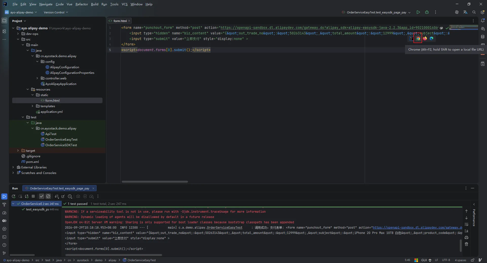
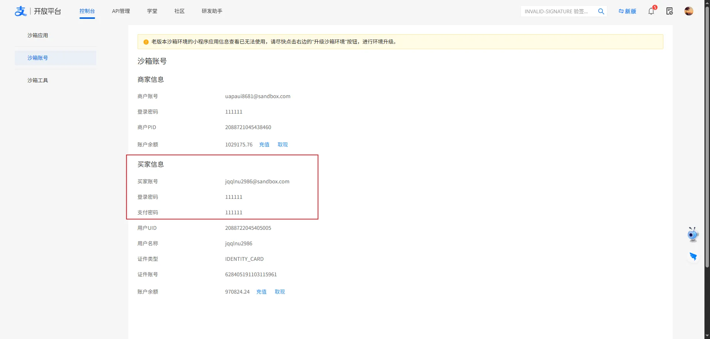
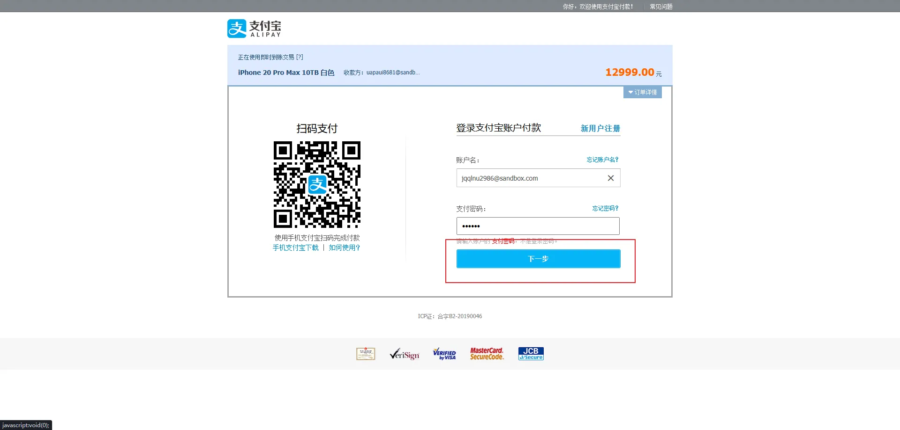
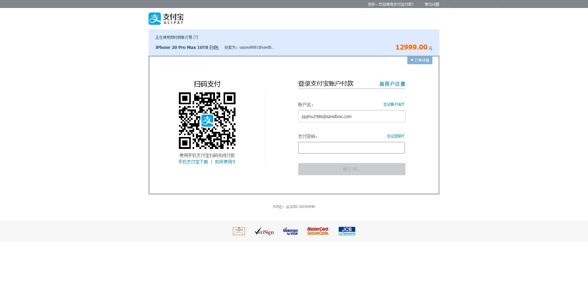
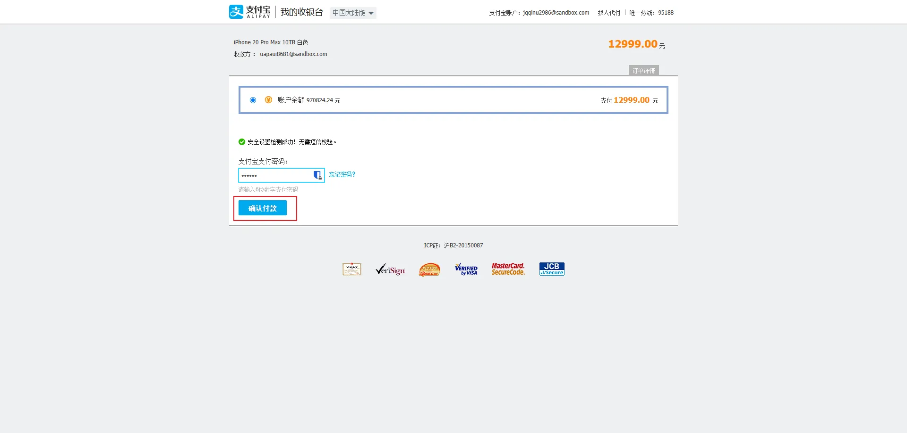
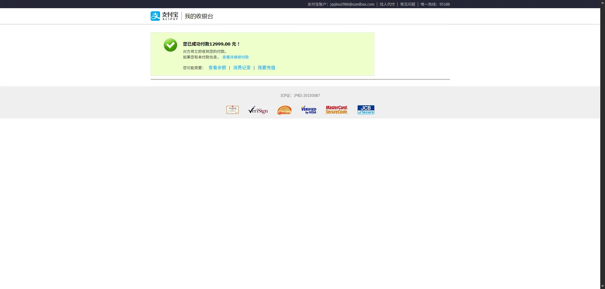

## 简介

电脑网站支付是指商户在电脑网页展示商品或服务，用户在商户页面确认使用支付宝支付时，浏览器自动跳转支付宝电脑网页完成付款的支付产品。该产品在签约完成后，需要技术集成方可使用。

## 一、简单测试

> 提供两种调用方式：EasySDK 简洁版、原生 SDK（V2）方式

### 1. EasySDK 方式

首先运行该程序，等待程序返回：
```java
package cn.ayostack.demo.alipay;

import com.alipay.easysdk.factory.Factory;
import com.alipay.easysdk.kernel.util.ResponseChecker;
import com.alipay.easysdk.payment.page.models.AlipayTradePagePayResponse;
import lombok.extern.slf4j.Slf4j;
import org.apache.commons.lang3.RandomStringUtils;
import org.junit.jupiter.api.Test;
import org.springframework.beans.factory.annotation.Value;
import org.springframework.boot.test.context.SpringBootTest;

/**
 * @author zhangh0803
 * @description EasySDK 电脑网站支付测试
 * @create 2026-09-28 15:26
 */
@Slf4j
@SpringBootTest
public class OrderServiceEasyTest {

    @Value("${alipay.notify-url}")
    private String notify_url;

    @Value("${alipay.return-url}")
    private String returnUrl;

    @Test
    public void test_easysdk_page_pay() {

        String subject = "iPhone 20 Pro Max 10TB 白色";
        String tradeNo = RandomStringUtils.insecure().nextNumeric(8);
        String amount = "12999";

        try {
            AlipayTradePagePayResponse response = Factory.Payment.Page()
                    .pay(subject, tradeNo, amount, returnUrl);
            // 支付单创建成功
            if (ResponseChecker.success(response)) {
                log.info("调用成功，支付表单: {}", response.getBody());
            } else {
                log.error("调用失败");
            }
        } catch (Exception e) {
            throw new RuntimeException(e);
        }
    }


}
```

运行程序后，等待控制台输出如下信息：
```shell
2026-09-29T10:18:18.953+08:00  INFO 11500 --- [           main] c.a.demo.alipay.OrderServiceEasyTest     : 调用成功，支付表单: <form name="punchout_form" method="post" action="https://openapi-sandbox.dl.alipaydev.com/gateway.do?alipay_sdk=alipay-easysdk-java-2.2.3&app_id=9021000140695566&charset=UTF-8&format=json&method=alipay.trade.page.pay&notify_url=http%3A%2F%2Fzhangh0803.natapp1.cc%2Fapi%2Fv1%2Falipay%2Fnotify&return_url=https%3A%2F%2Fdocs.ayostack.cn%3A441&sign=jEeNzWEa5UWHXhApwFALGRgiTmI4cwJp9ZhSM9QQpDHwboM5klRp7%2FyOoNui3rWu%2BLTjVv73yVvabMKQHEJYfjkztbLng8olQu7xNZIws9T3iQ3eTm3LaPl5KKSsVXpv2R5RgeXo7HkwR3Oo%2BF5qhD7U77r0zIps%2Biib2L8uMpTs5UuMWOWwHN1Z28ZXssW%2BRwvY%2BUjGEOkOP1v3S1j4qgmHSH7XwRaWSEcXaQD3%2BuHYw3Xtj0WS2FKnGetv3gWO8m4O75BM3cEaNu%2FKW5zbACo%2BXAHLUU08Rk7w7lg8vfa0H4Vm07DMvMYUhM7XyiY%2FMR9cdWPWYqswcsQN3q3vVg%3D%3D&sign_type=RSA2&timestamp=2026-09-29+10%3A18%3A18&version=1.0">
<input type="hidden" name="biz_content" value="{&quot;out_trade_no&quot;:&quot;50263143&quot;,&quot;total_amount&quot;:&quot;12999&quot;,&quot;subject&quot;:&quot;iPhone 20 Pro Max 10TB 白色&quot;,&quot;product_code&quot;:&quot;FAST_INSTANT_TRADE_PAY&quot;}">
<input type="submit" value="立即支付" style="display:none" >
</form>
<script>document.forms[0].submit();</script>

Process finished with exit code 0
```

接着将支付表单复制到任意一个 `html` 文件中，例如站长这里直接用 idea 打开即可， 鼠标点击对应浏览器按钮即可进入支付界面。



这里账号密码对应的就是沙箱中的`买家账号密码`，如下所示：


接着输入对应的买家账号密码，点击下一步：



最后再次输入支付密码点击确认即可：


看到付款成功界面表示成功付款：


再次点击该表单查看是否已经创建支付单：


### 2. SDK 方式（V2）

```java
package cn.ayostack.demo.alipay;

import com.alipay.api.AlipayApiException;
import com.alipay.api.AlipayClient;
import com.alipay.api.domain.AlipayTradePagePayModel;
import com.alipay.api.request.AlipayTradePagePayRequest;
import com.alipay.api.response.AlipayTradePagePayResponse;
import lombok.extern.slf4j.Slf4j;
import org.apache.commons.lang3.RandomStringUtils;
import org.junit.jupiter.api.Test;
import org.springframework.beans.factory.annotation.Autowired;
import org.springframework.beans.factory.annotation.Value;
import org.springframework.boot.test.context.SpringBootTest;

/**
 * @author zhangh0803
 * @description 原生 SDK 电脑网站支付测试
 * @create 2026-09-28 15:26
 */
@Slf4j
@SpringBootTest
public class OrderServiceSDKTest {

    @Value("${alipay.notify-url}")
    private String notify_url;

    @Value("${alipay.return-url}")
    private String returnUrl;

    @Autowired
    private AlipayClient alipayClient;

    @Test
    public void test_alipay_page_pay() {

        AlipayTradePagePayRequest  request = new AlipayTradePagePayRequest();
        AlipayTradePagePayModel model = new AlipayTradePagePayModel();
        model.setSubject("iPhone 20 Pro Max 10TB 黑色");
        model.setOutTradeNo(RandomStringUtils.insecure().nextNumeric(8));
        model.setTotalAmount("15999");
        model.setProductCode("FAST_INSTANT_TRADE_PAY");

        request.setBizModel(model);
        // request.setNotifyUrl(notify_url);
        request.setReturnUrl(returnUrl);

        try {
            AlipayTradePagePayResponse response = alipayClient.pageExecute(request);
            String form = response.getBody();
            log.info("表单：{}", form);
        } catch (AlipayApiException e) {
            throw new RuntimeException(e);
        }
    }


}
```

SDK 方式效果同样如上，这里就不再次演示了。

### 3. SDK 方式（V3）
暂无实现...

## 结语

注意：
- 实际开发中 `out_trade_no` 商户订单号必须保证唯一性，这里站长只是模拟测试。
- 异步通知 notify：支付宝会多次重试回调，**业务代码必须做幂等处理**，防止订单多次更新。
- returnUrl 只是页面跳转，**不能作为支付成功的依据**，支付结果一定要以 notify 异步通知为准！