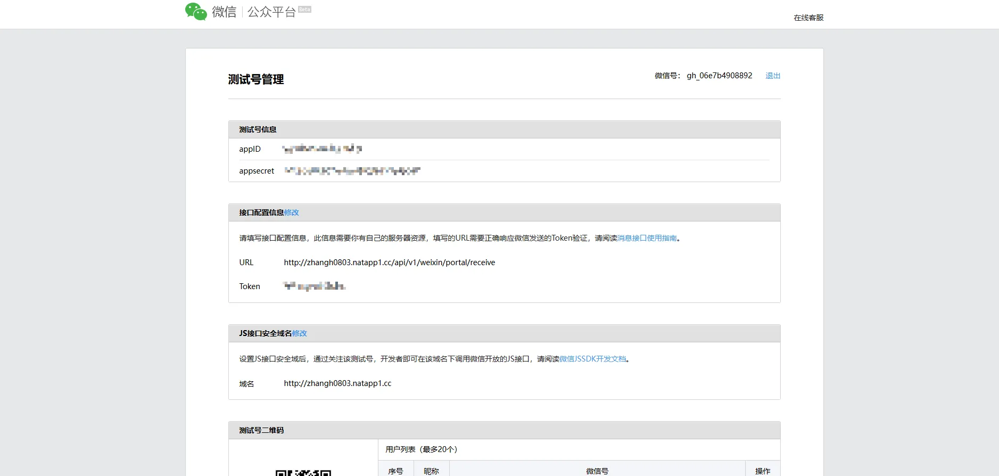

## 一、注册账号
首先需要前往[【微信公众测试平台】](https://mp.weixin.qq.com/debug/cgi-bin/sandboxinfo?action=showinfo&t=sandbox/index)注册账号
<br>
进入如下界面即可：


## 二、启用内网穿透服务
如果有小伙伴不了解什么是内网穿透的话可以看站长的另一篇文章 [【NATAPP 实现内网穿透】](/posts/260916_use_natapp/)

### 1. 启动 NATAPP 程序
> （Mac 或 Linux 系统的小伙伴按照你系统的方式启动，站长这里使用 windows 方式启动）

进入到 natapp.exe 同级目录执行：
```shell
natapp.exe -authtoken=你的token配置
```

当启动成功后，控制台会打印如下信息：
```shell
Powered By NATAPP       Please visit https://natapp.cn
Tunnel Status           Online
Version                 3.0.4
Forwarding              http://zhangh0803.natapp1.cc -> http://127.0.0.1:8000
Web Interface           Disabled
Total Connections       0
```

`Forwarding` 为 `http://zhangh0803.natapp1.cc -> http://127.0.0.1:8000` 表示将本地 `8000` 端口代理到 `http://zhangh0803.natapp1.cc` 地址。
<br>
`Tunnel Status` 为 `Online` 表示通道连接成功，此时可以正常的代理访问了。

## 三、接口配置信息

## 四、JS接口安全域名

## 五、实现简单的消息回复功能

文章持续更新中...